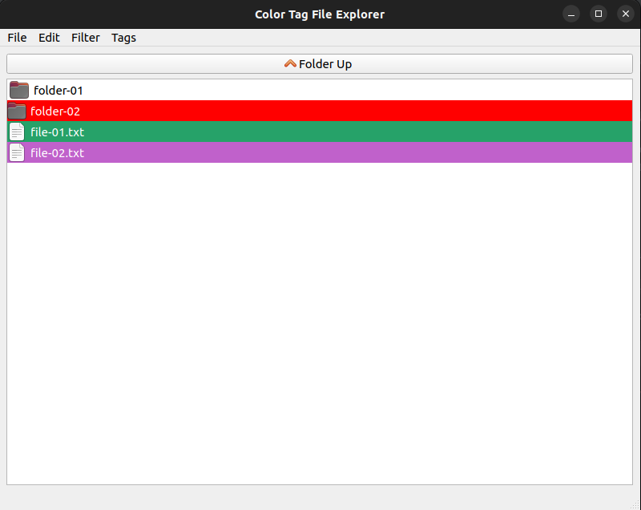

# File Explorer with Color Tags

Basic file explorer where you can highlight files and directories of different colors.
You can also add new tags, edit the old ones and filter files and directories per tag.


***

## Requirements

 - Python >=3.7 
 - PyQt5

## Run

 - Install PyQt5 with pip

   ```pip install pyqt5```
 
 - Execute the main file

   ```python3 main.py```
 
## Instructions

 - ### Change the tag
   To change the tag of a file or directory press right click over it.
   The tags change in cycle, so if you want to remove that tag, you must 
   traverse all the other tags.